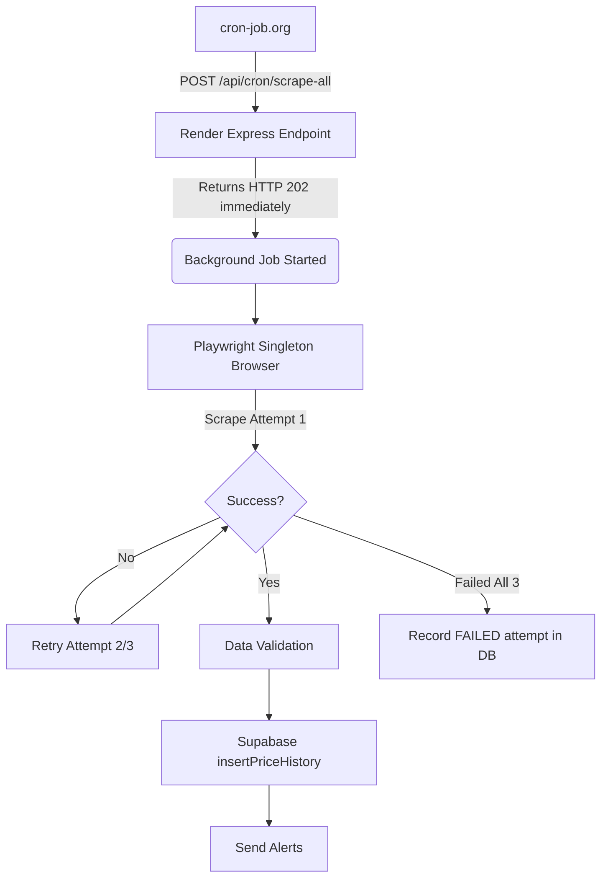

# INE Product Price Tracker

A robust, full-stack product price tracking system designed to monitor and record price changes and stock availability on a mock storefront. The system features a responsive React frontend, an Express/Playwright backend, and a scheduled cron job that accurately logs historical price data.

## Architecture

- **Frontend:** React (Vite) deployed on Vercel.
- **Backend:** Node.js + Express deployed on Render using Docker.
- **Scraper:** Playwright (Chromium) integrated directly into the Express backend.
- **Database:** PostgreSQL (via Supabase REST/Service Role).
- **Scheduler:** cron-job.org polling the backend every 2 hours.

## Features

- **Product Search & Tracking:** Users can add tracked products via their URL.
- **Historical Data:** Price and stock changes are recorded over time and displayed graphically.
- **Per-Product Scrape Logs:** Every scrape attempt (success or failure) is logged with its exact error message and duration.
- **Resilient Background Scraping:** Scheduled scraping runs every 2 hours in the background. 
- **Email Alerts:** (If configured) Price-drop and back-in-stock alerts via SendGrid.

## Why Playwright?

The mock storefront implements a proof-of-work challenge to prevent simple HTTP parsing. Specifically, the dynamic price block (`.price-success`) only loads after the mouse hovers and dwells over a specific area (`.price-block`), followed by waiting for and clicking a dynamically enabled "Reveal price" button. 

Playwright is used to:
1. Load a full headless Chromium context.
2. Physically move the mouse over the price block and dwell.
3. Wait for the "Reveal price" button to become actionable.
4. Extract the cleanly formatted text from the DOM.

## Scraping Flow



### Retry Behavior
Each product receives up to `MAX_ATTEMPTS = 3` per scheduled execution. Transient failures (e.g., page timeouts, intercepting overlays) trigger an exponential backoff retry. If a product fails all 3 attempts, it is honestly recorded as `FAILED` in the database without polluting the price history. The product will be automatically retried during the next 2-hour scheduled cron run.

## Local Setup

### 1. Database Setup
1. Create a Supabase project.
2. Ensure your schema includes the required `products`, `price_history`, and `scrape_logs` tables.

### 2. Backend (Server + Scraper)
```bash
cd server
npm install
```
Configure your `.env` (see below), then run:
```bash
npm run dev
```
*(This starts the backend on port 4000 by default)*

### 3. Frontend
```bash
cd frontend
npm install
npm run dev
```
*(This starts the Vite dev server, typically on port 5173)*

## Environment Variables
Create a `.env` file in the `server` directory using `.env.example` as a template:

- `PORT` - The Express server port (default 4000).
- `FRONTEND_URL` - Allowed CORS origin (e.g., `http://localhost:5173`).
- `SUPABASE_URL` - Your Supabase project URL.
- `SUPABASE_SERVICE_ROLE_KEY` - Your Supabase Service Role key (bypasses RLS). **Never expose this to the frontend.**
- `CRON_SECRET` - A long random string used to authenticate incoming POST requests from cron-job.org.
- `SENDGRID_API_KEY` - API key for sending email alerts.
- `ALERT_EMAIL_FROM` - Verified sender email address.

## API Overview

Key backend endpoints:
- `GET /api/products` - Fetch all tracked products.
- `GET /api/products/:id` - Fetch details, history, and logs for a single product.
- `POST /api/products` - Add a new product to tracking.
- `POST /api/products/:id/scrape` - Manually trigger an immediate synchronous scrape for a specific product.
- `POST /api/cron/scrape-all` - The secure endpoint polled by cron-job.org to trigger the background asynchronous scrape of all active products.

## Headed Run (Testing)
To see the scraper physically moving the mouse in a visible browser window, you can run the CLI test script:
```bash
cd scraper
node scraper.js --headed
```

## Reliability Notes
- **Cron Concurrency Lock:** If a cron job is currently running in the background, subsequent requests to `/api/cron/scrape-all` immediately return HTTP 202 with `message: "Cron scrape already running"`.
- **Browser Lifecycle:** The Playwright browser uses a "Singleton" pattern. Chromium is launched only once per server lifecycle and reused across scrapes to reduce memory and CPU overhead.
- **Graceful Failure:** To prevent cron-job.org from closing the connection due to its 30-second timeout limit, the `/api/cron/scrape-all` endpoint returns HTTP 202 instantly, processing the actual browser automation fully in the background.
